# NOLA DFC Manager — Technical Documentation

> **Version:** 1.0.0 | **Platform:** Web (PWA) | **Deployed:** nola-dfc-manager.vercel.app
> **Stack:** React 19 + Vite 7 + Supabase + Tailwind CSS 3

---

## Table of Contents

1. [Executive Summary](#executive-summary)
2. [System Architecture](#system-architecture)
3. [Authentication & Session Flow](#authentication--session-flow)
4. [Role & Permission System](#role--permission-system)
5. [Navigation Structure](#navigation-structure)
6. [Module Reference](#module-reference)
   - [Finance Hub](#finance-hub-financeroute)
   - [People Hub](#people-hub-peopleroute)
   - [Schedule](#schedule-scheduleroute)
   - [Insights & AI Chat](#insights--ai-chat-insightsroute)
   - [Season Evaluations](#season-evaluations-season-evaluationsroute)
   - [Club Admin](#club-admin-club-adminroute)
   - [Parent View](#parent-view-dashboard--parent)
7. [Budget Forecasting Engine](#budget-forecasting-engine)
8. [Data Layer — Services](#data-layer--services)
9. [Database Entity Model](#database-entity-model)
10. [Push Notifications & PWA](#push-notifications--pwa)
11. [Internationalization (i18n)](#internationalization-i18n)
12. [Export System](#export-system)
13. [Developer Guide](#developer-guide)

---

## Executive Summary

NOLA DFC Manager is a **full-stack club and team management Progressive Web App** built for youth soccer clubs. It provides a unified platform for club administrators, team managers, coaches, treasurers, and parents — each with a tailored, permission-gated experience.

**Core capabilities:**

- Multi-team, multi-season roster and compliance tracking
- Full financial management: budget planning, transaction ledger, and fundraising waterfall distribution
- Calendar and schedule management with iCal sync
- AI-powered financial insights via Google Gemini
- In-app season player evaluations with customizable rubrics
- PDF/CSV export for all major reports
- Web Push notification delivery
- Bilingual UI (English / Spanish)

---

## System Architecture

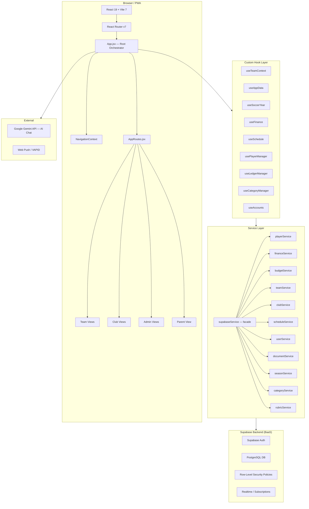

**Key architectural decisions:**

- **`supabaseService`** is a re-export facade — individual domain services (`playerService`, `financeService`, etc.) can be imported directly for new code, while legacy imports of `supabaseService` continue working unchanged.
- **`App.jsx`** acts as the central orchestrator, calling all hooks at the top level and passing results down to `AppRoutes` as props. This avoids deep context drilling while keeping all async state in one place.
- **`NavigationContext`** carries nav-related state (selected team, selected season, locale, theme) to sidebar components without passing through every route.

---

## Authentication & Session Flow

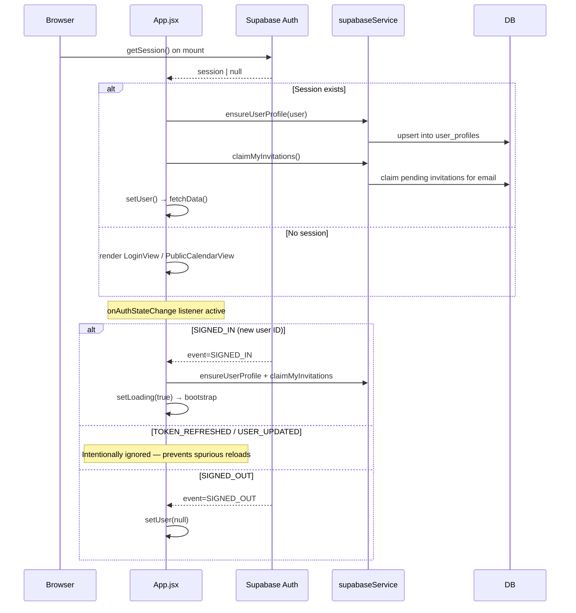

**Critical implementation notes:**

- `TOKEN_REFRESHED`, `INITIAL_SESSION`, and `USER_UPDATED` events are **explicitly ignored** in the auth state listener. This prevents a "random reload" bug that appeared every ~60 minutes when Supabase refreshed the JWT.
- `claimMyInvitations()` must complete **before** `setUser()` so that `useTeamContext`'s role fetch reads fully claimed rows.
- A `lastUserIdRef` ref guards against re-bootstrapping the same user on duplicate `SIGNED_IN` events.

---

## Role & Permission System

The app has a **three-tier hierarchical role system**:

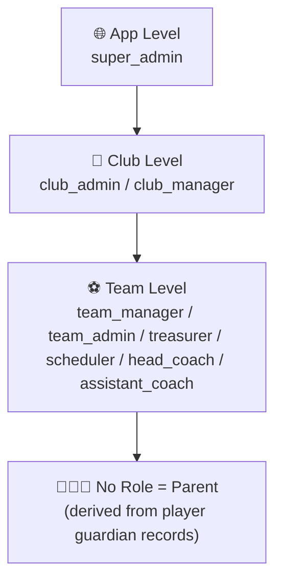

### Role Definitions

| Role              | Scope | Description                                                                    |
| ----------------- | ----- | ------------------------------------------------------------------------------ |
| `super_admin`     | App   | Global administrator. Full access to all clubs, teams, data.                   |
| `club_admin`      | Club  | Full access to all teams in the club. Can manage teams, roles, settings.       |
| `club_manager`    | Club  | Read-only access across all teams. Cannot edit settings or roles.              |
| `team_manager`    | Team  | Full team access + can manage other users' roles within the team.              |
| `team_admin`      | Team  | Full team access. Cannot manage user roles.                                    |
| `treasurer`       | Team  | Finance-only: budget, ledger, sponsors, waivers.                               |
| `scheduler`       | Team  | Schedule-only: create events, manage blackouts.                                |
| `head_coach`      | Team  | View roster + schedule. Can submit evaluations + manage rubric.                |
| `assistant_coach` | Team  | View roster + schedule. Can submit evaluations.                                |
| _(none)_          | —     | **Parent**: derives team from guardian records. Sees their player's data only. |

### Permission Matrix

| Permission        | super_admin | club_admin | club_manager | team_manager | team_admin | treasurer | scheduler | head_coach | assistant_coach |
| ----------------- | :---------: | :--------: | :----------: | :----------: | :--------: | :-------: | :-------: | :--------: | :-------------: |
| Manage Clubs      |     ✅      |            |              |              |            |           |           |            |                 |
| Club Settings     |     ✅      |     ✅     |              |              |            |           |           |            |                 |
| Manage Teams      |     ✅      |     ✅     |              |              |            |           |           |            |                 |
| Manage Club Roles |     ✅      |     ✅     |              |              |            |           |           |            |                 |
| View Any Team     |     ✅      |     ✅     |      ✅      |              |            |           |           |            |                 |
| View Roster       |     ✅      |     ✅     |      ✅      |      ✅      |     ✅     |    ✅     |    ✅     |     ✅     |       ✅        |
| Edit Roster       |     ✅      |     ✅     |              |      ✅      |     ✅     |           |           |            |                 |
| View Schedule     |     ✅      |     ✅     |      ✅      |      ✅      |     ✅     |           |    ✅     |     ✅     |       ✅        |
| Edit Schedule     |     ✅      |     ✅     |              |      ✅      |     ✅     |           |    ✅     |            |                 |
| View Budget       |     ✅      |     ✅     |      ✅      |      ✅      |     ✅     |    ✅     |           |            |                 |
| Edit Budget       |     ✅      |     ✅     |              |      ✅      |     ✅     |    ✅     |           |            |                 |
| View Ledger       |     ✅      |     ✅     |      ✅      |      ✅      |     ✅     |    ✅     |           |            |                 |
| Edit Ledger       |     ✅      |     ✅     |              |      ✅      |     ✅     |    ✅     |           |            |                 |
| View Sponsors     |     ✅      |     ✅     |      ✅      |      ✅      |     ✅     |    ✅     |           |            |                 |
| Edit Sponsors     |     ✅      |     ✅     |              |      ✅      |     ✅     |    ✅     |           |            |                 |
| View Insights     |     ✅      |     ✅     |      ✅      |      ✅      |     ✅     |    ✅     |           |            |                 |
| Manage Waivers    |     ✅      |     ✅     |              |      ✅      |     ✅     |    ✅     |           |            |                 |
| Manage Team Users |     ✅      |     ✅     |              |      ✅      |            |           |           |            |                 |
| Manage Rubric     |     ✅      |     ✅     |              |              |     ✅     |           |           |     ✅     |                 |
| Evaluate Players  |     ✅      |     ✅     |              |              |            |           |           |     ✅     |       ✅        |
| View Evaluations  |     ✅      |     ✅     |      ✅      |      ✅      |     ✅     |           |           |     ✅     |       ✅        |

### Role Assignment Rules

- **Club-assignable roles** (assigned by `club_admin`): `head_coach`, `assistant_coach`, `team_manager`
- **Team-assignable roles** (assigned by `team_manager` within their team): `team_admin`, `treasurer`, `scheduler`
- Parents have **no role record** — their access is derived from the `guardians` array on player records.

### `hasPermission()` Logic

```
src/utils/roles.js:276
```

```
For each userRole entry:
  1. App-level roles (super_admin) → grant immediately
  2. Club-level roles (club_admin/club_manager) → grant for any team
  3. Team-level roles → grant only if ur.teamId === requested teamId
```

---

## Navigation Structure

Navigation is split into four sections, each rendered conditionally based on role:

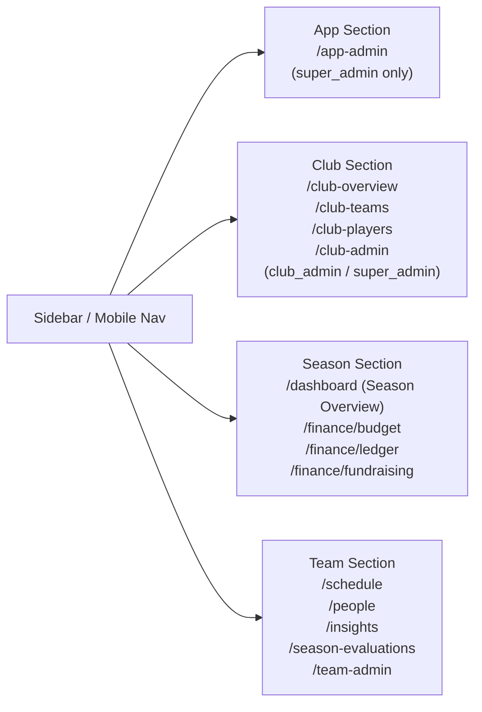

- **Desktop:** `DesktopSidebar` renders all four sections in a persistent left sidebar.
- **Mobile:** `MobileHeader` (top bar) + `MobileBottomNav` (bottom tab bar) + `MobileMenu` (slide-out drawer).
- **Single Team Mode** (`VITE_SINGLE_TEAM_ID` env var): Hides all Club and App nav sections — the app acts as a standalone team manager.

---

## Module Reference

### Finance Hub (`/finance/*`)

The Finance Hub is a tabbed view containing three sub-modules. Visible tabs are gated by permissions.

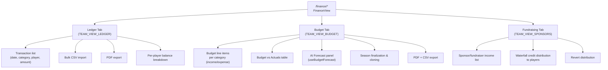

#### Ledger

The transaction ledger tracks every financial movement for the team season.

**Transaction fields:**
| Field | Description |
|---|---|
| `date` | Transaction date |
| `category` | Category code (e.g. `TMF`, `TOU`, `COA`) — see Category system |
| `title` | Human-readable description |
| `amount` | Positive = income, negative = expense |
| `playerId` | Optional: links to a specific player |
| `cleared` | Whether the payment has been confirmed received/sent |
| `accountId` | Which holding account the transaction belongs to |
| `waterfallBatchId` | Links distributed sponsor credits to the source transaction |
| `eventId` | Optional: links to a team calendar event |
| `split` | Split payment indicator |

**Bulk Upload:** Accepts CSV files. Rows are parsed and validated before insertion via `handleBulkUpload` → `useLedgerManager`.

**`teamBalance` calculation:**

```
Sum of cleared, non-waterfall, non-TRF transactions
where the account's holding type is not 'none'
```

#### Budget

Budget line items are defined per-season, per-category. The Budget view shows:

- **Planned** (entered budget) vs **Actual** (from transactions matching the category)
- **AI Forecast** values generated by the internal `budgetModel.js` engine (see [Budget Forecasting Engine](#budget-forecasting-engine))
- **Finalize Season**: locks the budget and enables fundraising waterfall distribution
- **Clone Season**: copies budget structure forward into a new season

#### Fundraising / Waterfall Distribution

When a season is finalized, sponsor income can be distributed to players proportionally. The "waterfall" mechanism:

1. A positive transaction (sponsorship income) is selected
2. Manager specifies a distribution amount, title, and per-player assignment
3. `handleWaterfallCredit()` creates child credit transactions linked by `waterfall_batch_id`
4. Distribution can be fully reverted via `revertWaterfall()`, which deletes the batch

---

### People Hub (`/people`)

A tabbed view managing all roster-related data for the selected team + season.

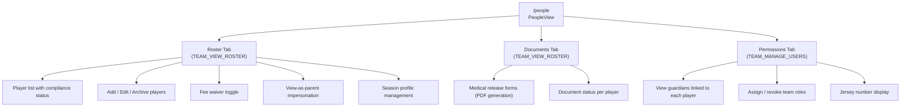

**Player Record Fields (key):**
| Field | Description |
|---|---|
| `firstName / lastName` | Player name |
| `birthDate` | Used to compute US Soccer age group |
| `jerseyNumber` | Displayed via `JerseyBadge` component |
| `status` | `active` or `archived` |
| `teamId` | Assigned team |
| `seasonProfiles[seasonId]` | Per-season enrollment data |
| `guardians[]` | Array of `{ name, email, phone }` — used for parent auth matching |
| `feeWaived[seasonId]` | Whether the season fee is waived |
| Compliance fields | `registrationComplete`, `birthCertificate`, `medicalRelease`, `photo`, `parentalConsent` |

**Parent Impersonation:** Staff can click "View as Parent" on any player to see exactly what that player's guardian would see. An amber banner is shown at the top of the app while impersonating. Exit returns to the normal staff view.

---

### Schedule (`/schedule`)

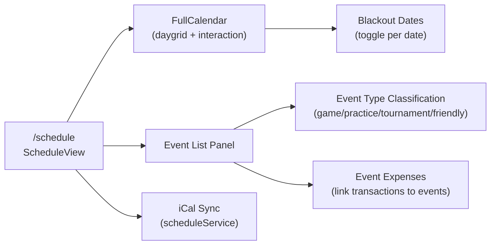

- **iCal Sync:** Imports events from an external calendar URL (stored in team settings). Events are matched against existing DB records by `eventMatcher.js` to avoid duplicates.
- **Event Type Classification:** `eventClassifier.js` auto-classifies imported events into types (`game`, `practice`, `tournament`, `friendly`). Staff can manually override with `typeLocked = true`.
- **Event Expenses:** Transactions can be linked to specific calendar events, enabling per-event cost tracking visible on the Schedule view.
- **Blackout Dates:** Team-level unavailability dates shown on the calendar, editable by users with `TEAM_EDIT_SCHEDULE`.

---

### Insights & AI Chat (`/insights`)

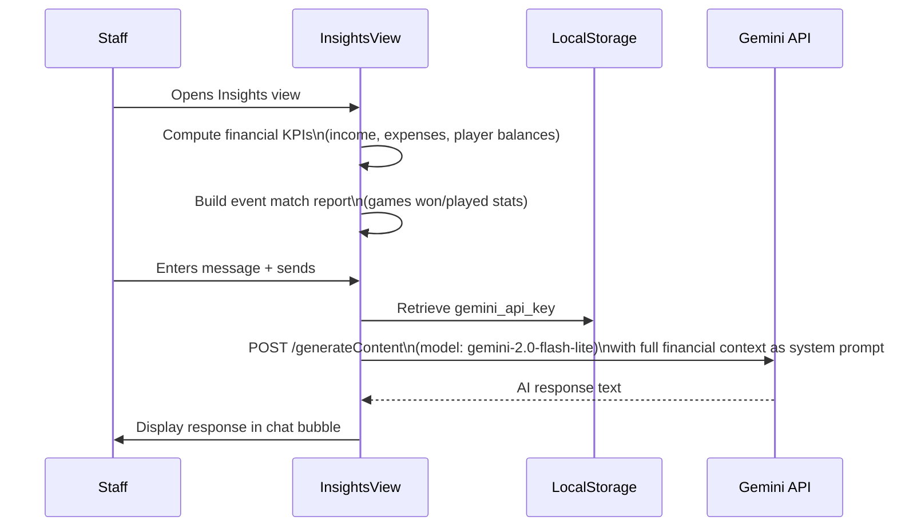

**KPI Panels computed client-side:**

- Total income vs. total expenses
- Player balance summary (total owed, total credited)
- Event match record (based on `eventMatcher.js` home/away detection)
- Budget variance alerts (>20% over/under)
- Per-category spending breakdown

**AI Chat:** Uses Google Gemini (`gemini-2.0-flash-lite`). The entire financial context (transactions, player balances, season data) is injected as a system prompt. The user's Gemini API key is stored in `localStorage` (never sent to any Supabase endpoint).

**Export:** The full insights panel can be exported as a PDF via `exportInsightsPDF`.

---

### Season Evaluations (`/season-evaluations`)

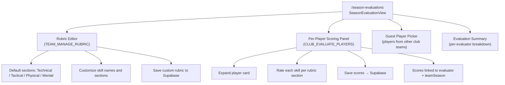

**Who can evaluate:**

- `head_coach`, `assistant_coach`, `club_admin`, `super_admin` (checked via `COACH_ROLES` set + `hasPermission`)

**Who can manage the rubric:**

- `head_coach`, `team_admin`, `club_admin`, `super_admin`

**Evaluator Selection:** If the current user is a `team_manager` or `club_admin`, they can select a different evaluator to view/submit scores on their behalf.

**Guest Players:** Players from other teams within the same club can be pulled in for evaluation (e.g., tryout scenarios). They are tracked separately in `guestPlayers` state and linked to the session.

**Rating Scale:** 5-point scale with labels defined in `RATING_LABELS` from `defaultEvaluationRubric.js`.

---

### Club Admin (`/club-admin`)

Tabbed hub for club-level configuration. Only accessible to `club_admin` and `super_admin`.

| Tab            | Description                                                                            |
| -------------- | -------------------------------------------------------------------------------------- |
| **Settings**   | Edit club name, logo, branding                                                         |
| **Users**      | View all users with roles across all teams. Assign/revoke roles.                       |
| **Categories** | Create custom transaction categories with name, code, color, and type (income/expense) |

**Custom Categories:** Each club can define custom category codes beyond the built-in defaults (`TMF`, `TOU`, `COA`, `OPE`, `LEA`, `FRI`, `FUN`, `SPO`). Custom categories are stored in Supabase and merged with built-in options via `useCategoryManager`.

---

### Parent View (`/dashboard` — parent)

Parents (users with no staff role) see a simplified dashboard:

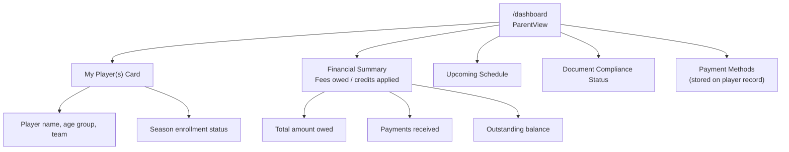

**Parent team derivation (two-pass):**

1. `useTeamContext` returns empty `teams` for parents (no role rows).
2. After `useAppData` resolves `players`, the app scans guardians to find `parentTeamId`.
3. `parentTeam` is then fetched directly via `supabaseService.getTeam()`.
4. This `parentTeamId` is passed to `useSoccerYear` so parents get correct season data.

---

## Budget Forecasting Engine

```
src/utils/budgetModel.js
```

A **pure JavaScript statistical model** with no external ML dependencies. It analyzes historical budget data across multiple seasons to predict future budgets per category.

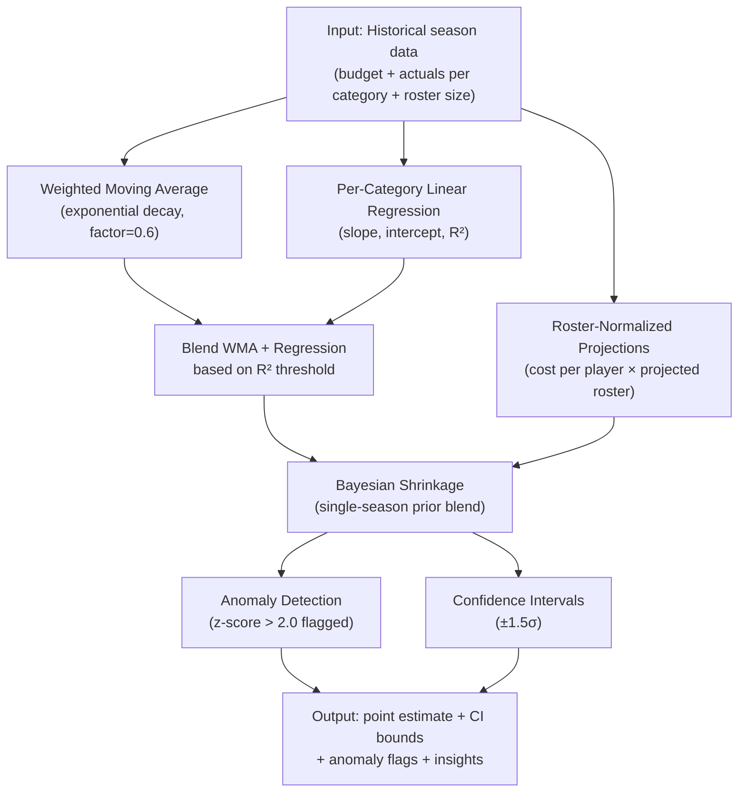

**Hyperparameters (tunable in `FORECAST_CONFIG`):**

| Parameter                  | Default | Description                                                        |
| -------------------------- | ------- | ------------------------------------------------------------------ |
| `decayFactor`              | 0.6     | Exponential decay for WMA — higher = more weight to recent seasons |
| `singleSeasonActualWeight` | 0.55    | Bayesian blend weight for actual spend                             |
| `singleSeasonBudgetWeight` | 0.25    | Bayesian blend weight for planned budget                           |
| `singleSeasonPriorWeight`  | 0.20    | Bayesian blend weight for global prior                             |
| `categoryPriorPerPlayer`   | $80     | Fallback cost per player when no history exists                    |
| `trendR2Threshold`         | 0.5     | Minimum R² before regression slope is trusted                      |
| `strongTrendR2Threshold`   | 0.7     | R² for high-confidence regression dominance (4+ seasons)           |
| `anomalyZThreshold`        | 2.0     | Z-score threshold for flagging anomalies                           |
| `budgetVarianceThreshold`  | 20%     | Budget vs actual variance before generating an insight             |
| `ciMultiplier`             | 1.5     | Confidence interval half-width multiplier                          |
| `minYearlyGrowthRate`      | 3%      | Minimum year-over-year growth floor applied to all forecasts       |

**Season completion extrapolation:** When a season is in-progress (not finalized), actuals are extrapolated to year-end based on completion percentage. Early-season results (< 25% complete) are dampened toward the planned budget to prevent overconfident projections.

---

## Data Layer — Services

All Supabase interactions are encapsulated in the `src/services/` directory. `supabaseService.js` is a facade that re-exports all domain services for backward compatibility.

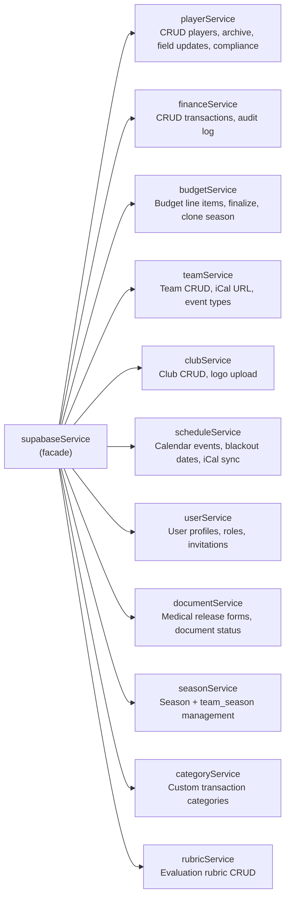

**Audit Logging:** `financeService` calls `logAuditEvent` (from `auditService.js`) on all transaction mutations. Audit events are stored in Supabase and contain the user ID, action type, and before/after state.

**Invitation Claim Flow:** On every login, `claimMyInvitations()` checks for pending `user_roles` rows where `invited_email` matches the authenticated user's email, and claims them (writes the user ID). This enables pre-assigned roles for users who haven't registered yet.

---

## Database Entity Model

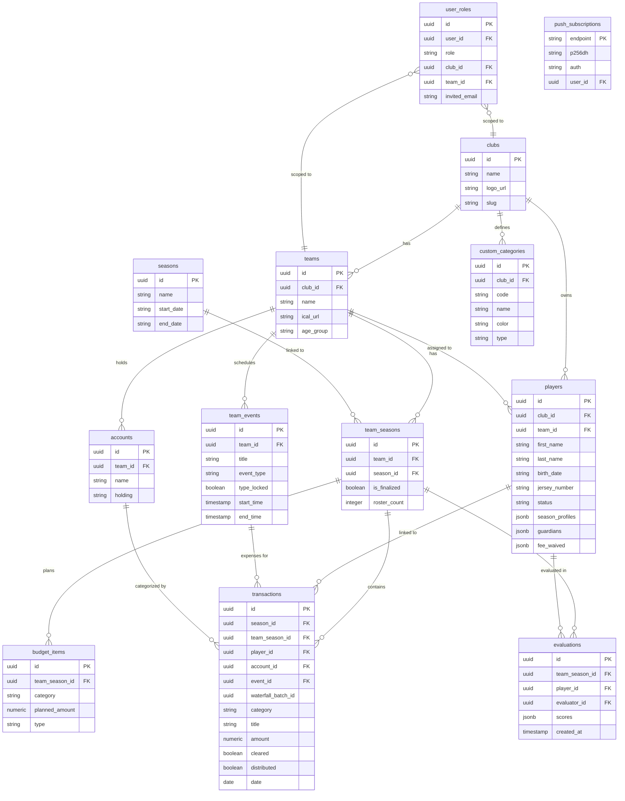

---

## Push Notifications & PWA

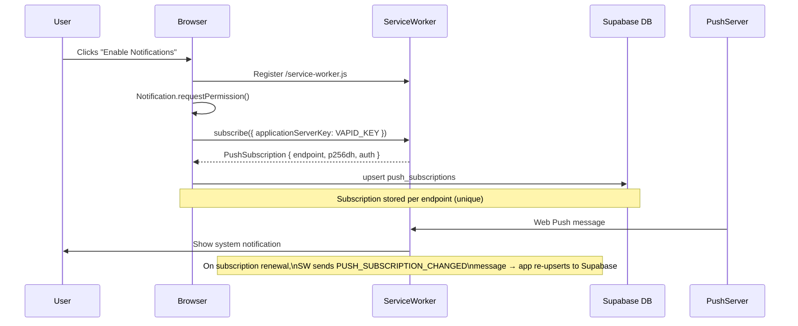

- **VAPID key** is stored in environment variables and used for push server authentication.
- Managed via `usePushNotifications` hook + `pushService`.
- `NotificationPermissionBanner` prompts users who have not yet granted permission.
- Service worker is registered at `/service-worker.js` (public directory).

---

## Internationalization (i18n)

The app supports **English (en)** and **Spanish (es)** via a custom lightweight i18n system.

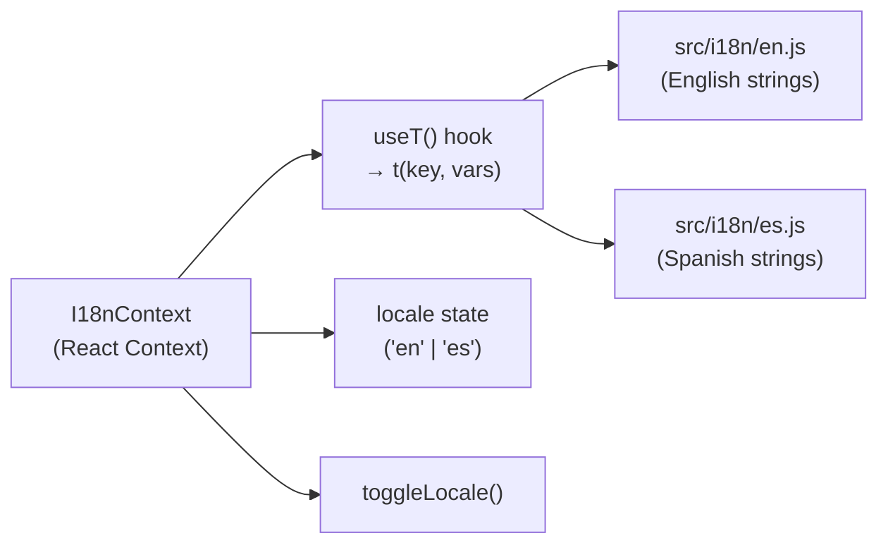

- **`t(key, vars)`**: Resolves a dot-notation key (e.g. `t('nav.schedule')`) against the active locale dictionary. Supports variable interpolation: `t('toast.syncedEvents', { n: 5 })` → `"5 events synced"`.
- **Locale toggle** is accessible from the sidebar settings panel and cycles between `en` and `es`.
- Locale preference is persisted to `localStorage`.
- All user-facing strings must use `t()` — hardcoded English strings in JSX are a lint concern.

---

## Export System

```
src/utils/exportUtils.js
```

All exports are client-side — no server round-trip required.

| Export Function                                          | Format          | Source View                                |
| -------------------------------------------------------- | --------------- | ------------------------------------------ |
| `exportToCSV(data, filename, columns)`                   | CSV             | Generic — used across ledger, budget, etc. |
| `exportLedgerPDF(transactions, seasonInfo, formatMoney)` | PDF (landscape) | Ledger                                     |
| `exportBudgetActualsPDF(...)`                            | PDF             | Budget                                     |
| `exportBudgetActualsCSV(...)`                            | CSV             | Budget                                     |
| `exportInsightsPDF(...)`                                 | PDF             | Insights                                   |

- PDF generation uses **jsPDF** (`^4.2.1`) directly — no server-side rendering.
- CSV generation uses a manual escape function (no external library dependency).
- QR code generation (`qrcode`) is available for document/link sharing use cases.
- Medical release PDFs are generated via `src/utils/generateMedicalPdf.js` using **pdf-lib**.

---

## Developer Guide

### Prerequisites

- Node.js 18+
- A Supabase project with the required schema applied
- `.env.local` with:

```env
VITE_SUPABASE_URL=https://your-project.supabase.co
VITE_SUPABASE_ANON_KEY=your-anon-key
VITE_VAPID_PUBLIC_KEY=your-vapid-public-key
# Optional: single-team mode
VITE_SINGLE_TEAM_ID=uuid-of-your-team
```

### Scripts

| Command                 | Description                          |
| ----------------------- | ------------------------------------ |
| `npm run dev`           | Start Vite dev server                |
| `npm run build`         | Production build (output to `dist/`) |
| `npm run preview`       | Preview production build locally     |
| `npm test`              | Run Vitest unit test suite           |
| `npm run test:ui`       | Vitest with browser UI               |
| `npm run test:coverage` | Coverage report via V8               |
| `npm run lint`          | ESLint (React hooks + refresh rules) |
| `npm run format`        | Prettier write across `src/`         |
| `npm run format:check`  | Prettier check (used in CI)          |

### Testing

- **Framework:** Vitest 4 + Testing Library
- **Test files:** `src/__tests__/` — organized by `hooks/` and `utils/`
- **Key test files:**
  - `budgetModel.test.js` — Forecast engine unit tests
  - `useBudgetForecast.test.js` — Hook integration tests
  - `roles.test.js` — Permission matrix coverage
  - `seasonUtils.test.js` — Season date computation
  - `singleTeamMode.test.js` — Single-team env detection
  - `holdings.test.js` — Account holding logic
- **Setup:** `src/__tests__/setup.js` configures jest-dom matchers

### Code Conventions

- **Service imports:** Prefer domain-specific service imports for new code:
  ```js
  // Preferred for new code
  import { playerService } from '../services/playerService';
  // Acceptable for legacy compatibility
  import { supabaseService } from '../services/supabaseService';
  ```
- **Permissions:** Always use `can(PERMISSIONS.SOME_PERMISSION)` in components — never hardcode role names in JSX.
- **i18n:** All user-visible strings must use `t('key')` from `useT()`.
- **Styling:** Tailwind utility classes via `clsx` + `tailwind-merge`. Use `cn()` from `src/lib/utils.js` for conditional class merging.
- **Git:** Conventional Commits format (`feat:`, `fix:`, `chore:`, `refactor:`, `docs:`). Imperative mood. No AI attribution in commit messages.

### Husky Pre-commit Hooks

Configured via `.husky/` + `lint-staged`. On commit:

1. ESLint runs on staged `.js/.jsx` files
2. Prettier formats staged files

### Deployment

- **Platform:** Vercel (configured via `homepage` in `package.json`)
- **Build command:** `npm run build`
- **Output directory:** `dist/`
- **Environment variables:** Set in Vercel dashboard (match `.env.local` keys)
