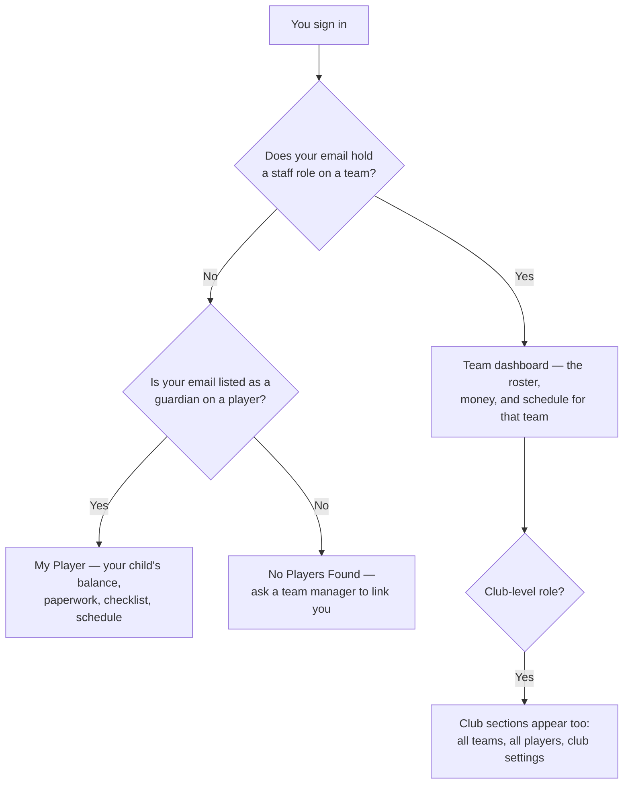
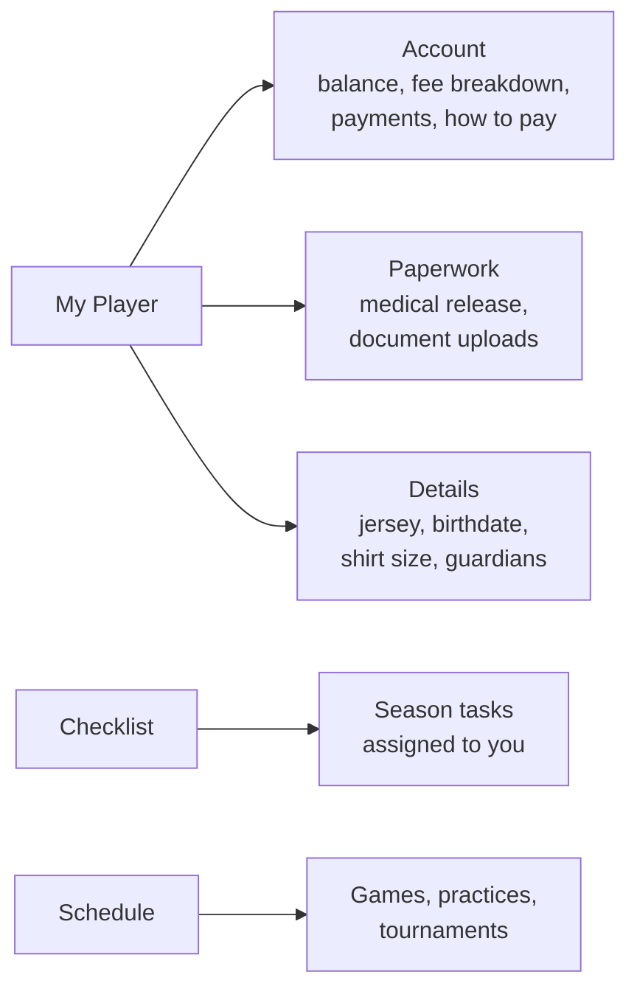
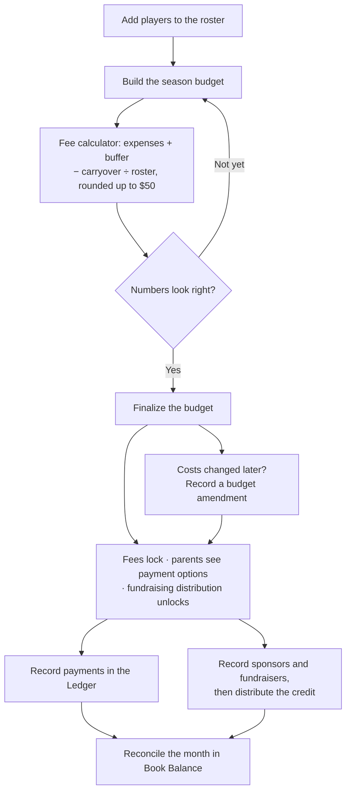
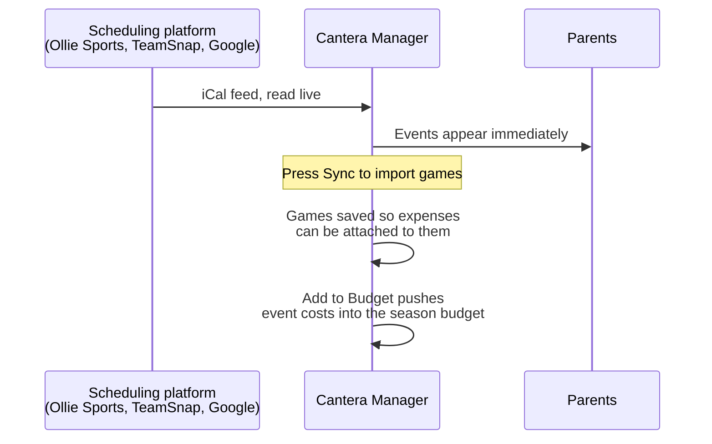

# Cantera Manager — User Guide

Everything a family or a staff member needs to use the team portal. Parents can stop after Part 1.

**Where to sign in**

| You are                           | Address                      |
| --------------------------------- | ---------------------------- |
| A NOLA DFC family or staff member | `portal.noladfc2015boys.com` |
| Any other club on Cantera Manager | `app.canteramanager.com`     |

Both open the same app. Use whichever address your club sent you.

---

## Contents

- [Part 0 — Getting started (everyone)](#part-0--getting-started-everyone)
- [Part 1 — Parents and guardians](#part-1--parents-and-guardians)
- [Part 2 — Team staff](#part-2--team-staff)
- [Part 3 — Club admins](#part-3--club-admins)
- [Reference — who can do what](#reference--who-can-do-what)
- [Troubleshooting](#troubleshooting)

---

## Part 0 — Getting started (everyone)

### What the app is for

One place for the things that used to live in a group chat and three spreadsheets: what a player owes, what the team has spent, when the team plays, and which paperwork is still missing.

What you see when you sign in depends on who you are. Nobody has to choose a mode — the app works it out.



### Creating your account and signing in

Your club does **not** create your password for you. You create the account yourself, using the email address the club has on file for you.

1. Open your club's address.
2. Choose **Sign Up** if this is your first visit, or enter your email and password if you already have an account.
3. Use the **same email address the club has on file**. This is what links you to your player or your staff role. A different address signs you into an empty account.

Other ways in, all on the same screen:

- **Continue with Google** — fastest if your club email is a Google account.
- **Magic Link** — emails you a one-time sign-in link, so there is no password to remember. This signs in an existing account only; create the account with a password first.
- **Forgot password** — sends a reset link. The confirmation message looks the same whether or not the address has an account, so check the inbox you actually used.

### Language and appearance

- The **globe** icon (bottom of the sign-in screen, top bar once inside) switches between **English and Español**. It remembers your choice.
- The **sun/moon** icon in the top bar cycles light, dark, and follow-my-device.

### Install it on your phone

The portal works in any browser, but installing it gives you an app icon, full-screen layout, and — importantly on iPhone — the ability to receive notifications.

- **iPhone / iPad:** open the portal in Safari, tap the **Share** button, then **Add to Home Screen**. Open the app from that icon from now on.
- **Android:** tap **Install** when the browser offers it, or use the browser menu's **Install app** / **Add to Home Screen**.

### Notifications

Tap the **bell** in the top bar and choose **Enable Notifications** to get team announcements on your device. On iPhone the bell offers **Install for Notifications** instead — Apple only allows notifications for installed apps, so add it to your Home Screen first.

### Working without signal

Fields have bad reception. If you lose your connection, a banner reads **"You are offline — showing cached data"** and the app keeps showing the last data it loaded. Changes you make are queued — you will see **"changes waiting to sync"** — and they upload on their own when you are back online. Do not re-enter them.

### Finding your way around

| Where                   | What is there                                                                                            |
| ----------------------- | -------------------------------------------------------------------------------------------------------- |
| Left sidebar            | Your pages, grouped by **Club**, **Season**, and **Team**. On a phone it slides in from the menu button. |
| Team and season pickers | Top of the sidebar. Staff on multiple teams switch teams here; everyone switches season here.            |
| Top bar                 | Theme, language, notification bell, and your account menu.                                               |
| Account menu            | Your email and role, the **Update Log** (what changed in recent releases), and **Logout**.               |

---

## Part 1 — Parents and guardians

### How you get access

There is nothing to request. When a team manager adds your player to the roster, they enter each guardian's email address. The first time you sign in with that address, the app matches it and your player appears.

If you see **"No Players Found"**, your sign-in email does not match any guardian record. Contact your team manager and give them the exact address you signed in with.

### Your three tabs

Everything about your player sits under **My Player**, on three tabs.



### Account — what you owe and why

The top of the tab shows the **Remaining Balance** and a progress bar. Below it, the **Fee Breakdown** shows exactly how the app got to that number:

| Line                 | What it means                                     |
| -------------------- | ------------------------------------------------- |
| Base Season Fee      | Your player's share of the season budget          |
| Team Fees Paid       | Money you have paid, as recorded by the treasurer |
| Fundraising Applied  | Credit from fundraisers, distributed by the team  |
| Sponsorships Applied | Credit from sponsors, distributed by the team     |
| Credits / Discounts  | Anything the team applied by hand                 |

**Watch for the budget status banner.**

- **Budget in Draft** — the fee is an estimate and can still change. It is labelled _est._ and payment options are hidden until the team finalizes.
- **Budget Finalized** — fees are locked and payment options appear.
- **Fee Waived** — your player is exempt from the fee this season.

### How to pay

Once the budget is finalized, a **How to Pay** section appears with your team's payment methods — Venmo, Zelle, Cash App, cheque, or whatever the treasurer set up — with the handle to send to and a suggested memo. Amounts shown are your family's own numbers, already worked out.

Payments are **recorded by the treasurer**, not by the payment app. Expect a short delay between sending money and seeing your balance change. If a week goes by, message your treasurer.

### Paperwork

**Medical Release Form.** Tap **Complete Medical Form** and fill it in on screen. It is the one form marked _Required_, and completing it ticks off the matching item on your checklist automatically. You can come back and update it later. Medical forms are visible only to you and to team managers — not to coaches or the treasurer.

**Uploading documents.** Under **Documents**, tap **Upload Document**:

1. Choose **Select File**, or **Take Photo** to snap it with your phone camera.
2. Pick the **Document Type** — birth certificate, player photo, parent ID, insurance card, and so on.
3. Tap **Upload**.

Files must be **10 MB or smaller**. Photos are compressed for you. You can view or delete anything you uploaded.

### Season checklist

The **Checklist** page lists what the team needs from you this season — order a uniform, register with the league, read a policy. Each item asks for one thing:

| Item type     | What you do                                    |
| ------------- | ---------------------------------------------- |
| Checkbox      | Tap **Mark done** when it is done              |
| Acknowledge   | Read the instructions, tap **I acknowledge**   |
| Short answer  | Type an answer and save                        |
| Date          | Pick a date                                    |
| Visit a link  | Open the link, then confirm **I've done this** |
| Upload a file | Attach a document                              |

**Required** items count toward your completion percentage; optional ones do not. Some items say **Awaiting staff confirmation** after you finish them — that is normal, a manager signs those off. Items with a due date show **Overdue** in red once the date passes.

### Schedule

**Schedule** shows the team's games, practices, and tournaments, as a list or a calendar. It follows the team's real scheduling feed, so it updates when the club changes something. Your club may also give you a public calendar link that works without signing in.

---

## Part 2 — Team staff

This part covers managers, treasurers, schedulers, coaches, and fundraiser volunteers. Your role decides which of these pages you actually see — see the [reference table](#reference--who-can-do-what).

### The season, start to finish



### Roster and people

**Players → Roster** is where the roster lives.

- **Add Player** captures name, jersey number, date of birth (which sets the US age group), shirt size, and one or more guardians. **The guardian email is what gives that family access** — get it right and the parent portal takes care of itself.
- **Bulk Upload** imports a roster from CSV instead of typing.
- **Season enrollment** controls which season a player belongs to. Removing a player from a season removes that season's fee data for them.
- **Archive** takes a player off the active roster while keeping their history.
- **Waive fee** exempts a player from the season fee (managers and treasurers).
- **View as Parent** opens the app exactly as that family sees it — read-only, so you cannot change anything by accident. Use it when a parent says "I can't find it".

**Players → Documents** tracks uploads per player: what is on file, what is verified, what is still missing. Required versus optional is shown separately so an optional gap does not read as non-compliance.

### Budget

**Season → Budget** builds the season's numbers and sets what every family owes.

1. Enter budget line items for the season (fall and spring).
2. Set the **buffer** — a contingency percentage on top of expenses, 5% by default.
3. Enter any **carryover** — cash rolled over from last season, which reduces what the roster has to cover.
4. Confirm the **roster size** — the number of fee-paying players.

The fee calculator then works out:

```
fee per player = ⌈ (expenses + buffer − carryover) ÷ roster size ⌉  rounded up to the next $50
```

**Save Draft** keeps it editable; parents see an estimate and cannot pay yet. **Finalize** locks the fee, shows parents their payment options, and unlocks fundraising distribution. You can also **clone** a finalized budget from a previous season as a starting point.

**Amendments.** After finalizing, changes are recorded as amendments with a reason. A team setting decides what an amendment does to fees:

- **Recalculate fees** (default) — the season fee is recomputed, so what every player owes changes.
- **Keep fees as they are** — the finalized fee stands and the overrun comes out of the buffer or carryover.

### Ledger

**Season → Ledger** is the transaction record. Every payment, expense, credit, and transfer.

- **Add Transaction** — title, amount, date, category, payment method, and the **account** the money moved through. Link it to a player (a fee payment) or to a schedule event (a tournament cost). Mark it **Funds Cleared** when the money has actually landed; uncleared entries show as pending.
- **Transfers** move money between the team's own accounts without counting as income or expense.
- **Refund** — the ↩ button on a row records money going back. It writes a linked reversing entry instead of making you type a second transaction, and that entry folds into the original row rather than taking a line of its own: the row shows the original amount struck through with the net beside it, tagged **Refunded**. Expand the row with the ▸ arrow to see each refund, its date and status, and to delete one if it was recorded in error. Refund the full amount or part of it, as many times as needed. Use the **Refunds** filter to find every affected transaction. Transfers cannot be refunded — reverse those with another transfer.
- **Filters** cover category, type, account, cleared status, date range, and free text.
- **Bulk Upload** imports transactions from CSV; the statement importer reads a bank or wallet export.
- **Export** produces a CSV or PDF of what you are looking at.

### Book Balance

**Season → Book Balance** answers "does the app agree with reality?", one month at a time.

1. Enter the real balance of each account — from your bank app, Venmo, or the cash box.
2. The app shows its own figure beside yours and the difference.
3. When everything matches, **Lock Month** to take a permanent snapshot. Locked months stop non-admins from editing the stated balances. A warning appears if the ledger changes after a lock, which means the snapshot is stale.

### Fundraising and sponsors

**Season → Fundraising** turns money raised into player credit. **The budget must be finalized first.**

**Record Funds** logs the money: sponsorship or fundraiser, sponsor or event name, amount, which account it went into, and optionally which player brought it in. Leave **Funds received** unticked for a pledge that has not been paid — pledges do not count toward balances until received.

Then choose how it splits. The **Distribution Method** applies to future distributions:

| Method               | What happens                                                                                |
| -------------------- | ------------------------------------------------------------------------------------------- |
| **Waterfall**        | Credit the linked player first, overflow splits across teammates, remainder to the team pot |
| **Direct to Player** | Only the linked player is credited; anything above their balance goes to the team pot       |
| **Even Split**       | Split equally across all buy-in players regardless of who raised it                         |
| **Team Pot**         | Everything goes to the team; no player is credited                                          |

**Distribute Funds** applies it. **Distribute All** runs through everything pending in one pass. **Split manually** overrides the method for a single deposit and lets you assign exact amounts. Every distribution appears in **Distribution History** with a one-click **Undo** that reverses the whole batch.

### Schedule



- **Team Settings → Calendar Feed** takes the `.ics` URL from your scheduling platform. The app verifies it before saving. Events then display live; no import needed to view them.
- **Sync** imports game events into the app so you can attach expenses to them.
- Event **types** — tournament, league, friendly, practice — are classified automatically and can be corrected by clicking the label.
- **Blackout dates** mark windows the team is unavailable. The planner warns when a proposed date falls inside one.
- **Planner** builds matchups before they are official: opponent, home/away, location, notes. Confirm one to put it on the schedule, or mark it for rescheduling when it rains out. **Club & Team Contacts** keeps opponent phone numbers and emails alongside it.
- **Manage Expenses** on an event tracks its costs — referee fees, registration, field rental — with suggested lines for the event type. **Bulk Expenses** applies the same lines across many events at once, skipping duplicates.
- **Add to Budget** pushes an event's costs into the season budget. If the budget is finalized this is recorded as an amendment, and the screen tells you whether player fees will be repriced.

### Season checklist (staff side)

**Team → Checklist** is where the parent checklist comes from.

1. **Create Checklist**, or **Clone from another season** to reuse last year's items. Cloned checklists arrive as drafts with nobody's answers carried over.
2. Add items. Each has a task name, optional instructions, a response type, an optional due date, and two switches: **Required** (counts toward completion) and **Staff must confirm** (stays incomplete until a manager signs it off).
3. Set the **audience** — parent items appear on My Player; staff items are tracked internally and parents never see them.
4. **Publish to parents.** Until you publish, parents see nothing.

**Roster Progress** shows the whole team as a grid. **Bulk edit** stages changes across many players or many tasks and saves them together, and **Export CSV** hands the grid to a spreadsheet.

### Insights

**Team → Insights** reports collection rate, outstanding balances, category breakdown, budget burn, and event costs, and exports a report. The **Budget Advisor** chat answers questions about your own budget and schedule; it needs a free xAI API key, which is stored in your browser only.

### Team settings

**Team → Settings**, for managers and schedulers:

- **Accounts** — where the team holds money. Mark an account **parent-facing** and give it a handle to have it appear as a payment method on My Player.
- **Calendar Feed** — the `.ics` URL described above.
- **Payment Instructions** — free text shown to families who owe money, with merge tokens that fill in each family's own numbers: `{balance}`, `{fee}`, `{paid}`, `{player}`, `{first}`, `{last}`, `{team}`, `{memo}`. Tokens do arithmetic, so `{balance / 3}` or `{ceil(fee / 4)}` splits a fee without hardcoding it. A preview shows sample values.
- **ReePlayer Links** — sign-up and fan links surfaced to parents.
- **View Scope** — club admins can hide the club sections and see only team management. It affects your browser only and changes nothing about your permissions.

### Users

**Team → Users** assigns treasurer, scheduler, and fundraiser roles to people on your team. Team manager, head coach, and assistant coach are assigned by a club admin.

---

## Part 3 — Club admins

| Page                | What it does                                                                                |
| ------------------- | ------------------------------------------------------------------------------------------- |
| **Club → Overview** | Every team at a glance — players, compliance rate, documents, staff                         |
| **Club → Teams**    | Create, rename, and archive teams; assign managers and coaches; run the **new team wizard** |
| **Club → Players**  | Every player in the club, across teams                                                      |
| **Club → Settings** | Club name and details, staff directory and invitations, and custom transaction categories   |

Custom categories add club-specific labels to the ledger. Deleting one leaves existing transactions with the underlying code but the label may no longer display.

---

## Reference — who can do what

| Role                  | Assigned by  | Scope        | Can                                                                                          |
| --------------------- | ------------ | ------------ | -------------------------------------------------------------------------------------------- |
| **Club Admin**        | Super admin  | Whole club   | Everything, on every team                                                                    |
| **Club Manager**      | Club admin   | Whole club   | View any team; change nothing                                                                |
| **Team Manager**      | Club admin   | One team     | Everything for that team, plus team roles, the checklist, and medical documents              |
| **Treasurer**         | Team manager | One team     | Budget, ledger, fundraising, fee waivers, insights                                           |
| **Scheduler**         | Team manager | One team     | Schedule, events, blackouts, calendar feed; view roster                                      |
| **Fundraiser**        | Team manager | One team     | Sponsors and distributions; view roster and budget. No ledger access — does not handle money |
| **Head Coach**        | Club admin   | One team     | View roster, schedule, and compliance; run evaluations                                       |
| **Assistant Coach**   | Club admin   | One team     | View roster, schedule, and compliance                                                        |
| **Parent / Guardian** | Automatic    | Own children | Their own player's balance, paperwork, checklist, schedule                                   |

Two notes worth remembering:

- Parents are never assigned a role. Access comes from being listed as a guardian on a player.
- Medical release documents are restricted to the family and team managers, even from coaches and the treasurer.

---

## Troubleshooting

| What you see                              | What to do                                                                                                            |
| ----------------------------------------- | --------------------------------------------------------------------------------------------------------------------- |
| **"No Players Found"** after signing in   | Your sign-in email does not match a guardian record. Send your team manager the exact address you used.               |
| Balance looks wrong or out of date        | Payments are entered by hand. Allow a few days, then message the treasurer with the date and amount you sent.         |
| Fee says **est.** and you cannot pay      | The budget is still a draft. Payment options appear when the team finalizes it.                                       |
| Upload fails                              | The file is over 10 MB. Retake the photo or export a smaller file.                                                    |
| Bell offers **Install for Notifications** | You are on iPhone. Add the app to your Home Screen first, then enable notifications from the installed app.           |
| **"You are offline"** banner              | You are seeing cached data. Anything you change is queued and syncs when signal returns — do not re-enter it.         |
| Schedule is empty                         | No calendar feed is configured. A manager or scheduler adds it in Team Settings.                                      |
| **"Page not available"**                  | The page does not exist, or your role does not include it. If you just switched teams or scopes, pick the team again. |
| Fundraising distribution is blocked       | The season budget has to be finalized before funds can be distributed.                                                |
| Something else                            | Team-level questions go to your team manager; account and access questions go to a club admin.                        |

---

_Cantera Manager is built and maintained by TranTech Solutions, LLC. Check the **Update Log** in your account menu to see what changed recently._
